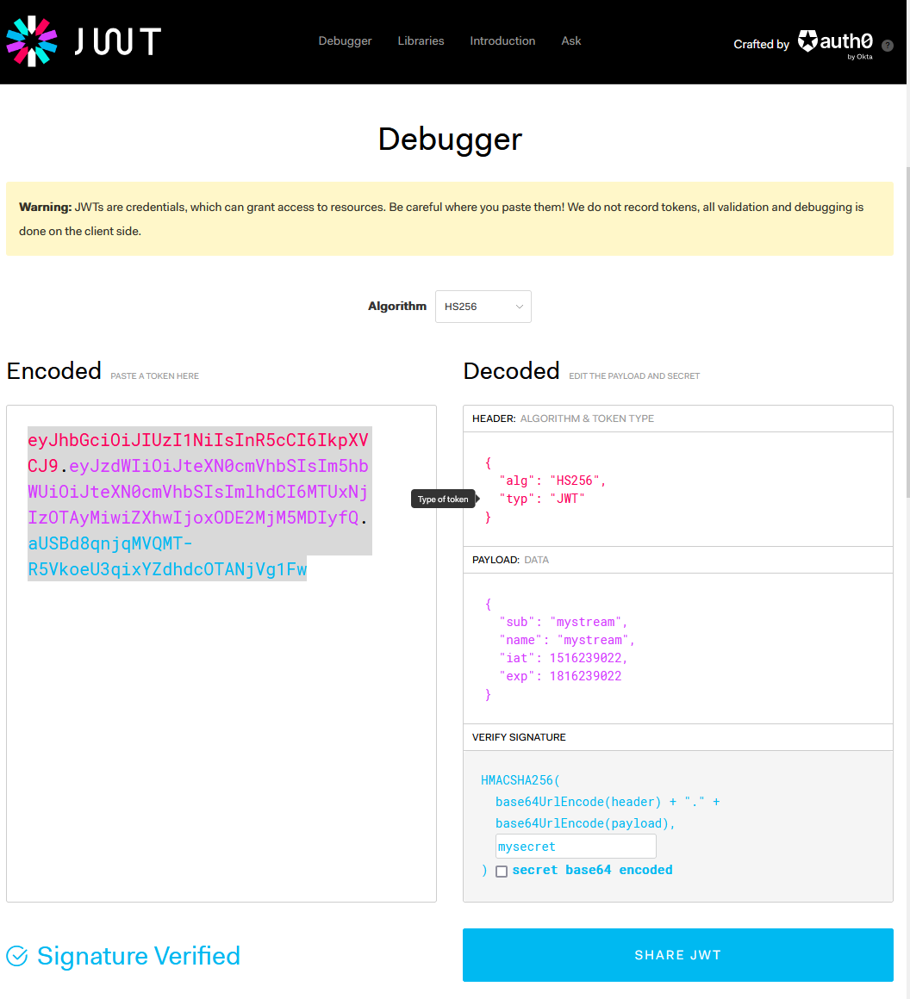

# dalesjo-webrtc
These are Wowza Streaming Engine plugins for handling webrtc

## WebRTCAuthentication
WebRTCAuthentication is based on documentation in [Control access to WebRTC publishing and playback](https://www.wowza.com/docs/control-access-to-webrtc-publishing-and-playback#enhance-webrtc-publishing-and-playback-security-with-a-custom-http-provider). It uses an [JWT/Token](https://jwt.io/) to control access for who can publish and play video streams. 

With the default configuration below, only users who includes a valid Token  in their userdata, will be able to connect using webrtc. The user will only be able to publish a stream with the same name as the subject in their token.

### Installation
Copy dalesjo-webrtc.jar to your lib directory.

In vhost.xml replace the HTTP Provider 
com.wowza.wms.webrtc.http.HTTPWebRTCExchangeSessionInfo with WebRTCAuthentication

```xml
<HTTPProvider>
    <BaseClass>com.dalesjo.wowza.WebRTCAuthentication</BaseClass>
    <RequestFilters>*webrtc-session.json</RequestFilters>
    <AuthenticationMethod>none</AuthenticationMethod>
</HTTPProvider>
```

### Configuration
In your application.xml add the following 3 properties.

```xml
<Property>
    <Name>dalesjo-webrtc-subject-only</Name>
    <Value>true</Value>
    <Type>Boolean</Type>
</Property>
<Property>
    <Name>dalesjo-webrtc-parameter</Name>
    <Value>token</Value>
    <Type>String</Type>
</Property>
<Property>
    <Name>dalesjo-webrtc-secret</Name>
    <Value>secret</Value>
    <Type>String</Type>
</Property>
```

| Property | Description |
|----------------------------|-------------|
|dalesjo&#x2011;webrtc&#x2011;subject&#x2011;only | If set to true, the users can only publish one stream that has the same name as the subject field in their token|
|dalesjo-webrtc-parameter | This is the key used to send the token in your userdata|
|dalesjo-webrtc-secret | This is the secret you use to generate and validate your created tokens.|

# Example

## Testpages

Below are two slightly modified examples from [Wowza Media Systems WebRTC client examples](https://github.com/WowzaMediaSystems/webrtc-examples) you can use them to connect to your wowza server after you configured the plugin

https://dalesjo.com/examples/webrtc/broadcast.html
https://dalesjo.com/examples/webrtc/play.html

Source code for the modified client page can be found [here](https://github.com/Dalesjo/webrtc-example)

## Token
You can use [jwt.io](https://jwt.io/) to generate your first test token. Below i have generated a token which only will be allowed to publish an stream called mystream and it will only be able to do so until it expires. the token secret is mysecret.



# Other Info

## Build
This have been built and tested with Wowza Streaming Engine 4.8.18. Wowza is shipping its own version of Java, to make eclipse build a working .jar file. I hade to configure eclipse to use the included jdk/jre version instead. (See picture below)

If you do not do this, Wowza will nog log any usefull information when trying loading the plugin. 


